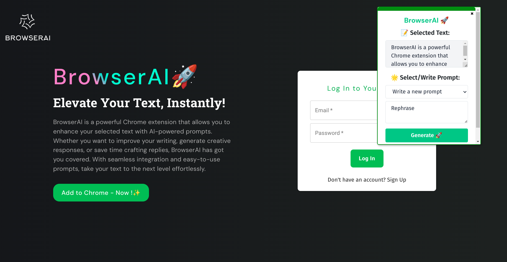

# Browser_AI 🚀️

BrowserAI is a powerful Chrome extension that allows you to enhance your selected text with AI-powered prompts. Whether you want to improve your writing, generate creative responses, or save time crafting replies, BrowserAI has got you covered. With seamless integration and easy-to-use prompts, take your text to the next level effortlessly.

## Installation 📑️

To install the ChatGPT Chrome Extension, follow these steps:

1. Clone this GitHub repository or download the ZIP file and extract it to a local directory.

2. Open Google Chrome and navigate to `chrome://extensions` in the address bar.

3. Enable the **"Developer mode"** by checking the checkbox in the top right-hand corner.

4. Click on the **"Load Unpacked"** button and select the local `Browser_AI/extension` directory that you cloned or extracted earlier.

5. The BrowserAI Chrome Extension will be added to your browser, and you'll see **"Apply BrowserAI"** in the context menu when you select text in any browser and right-click.

## Configuration ✨️

Before using the extension, you'll need to provide your OpenAI API key. To do this:

1. After installing the BrowserAI Chrome Extension, click on the extension icon in the Chrome toolbar.

2. The extension will prompt you to provide your OpenAI API Key.

3. Next, the extension will ask you to log in to your account to fetch your prompts (optional). You will have to use same login credentials as web app.

4. Apply BrowserAI and Elevate your Texts 🚀️:
   - Select any text within the web browser, by right clicking select "Apply BrowserAI".
   - On top right a popup will appear.
   - The popup has following elements:
     - Dropdown with your prompts. The default selection is "Write new prompt."
     - "Generate" button to start applying the prompt on text and start generation process.
     - If "Write new prompt" is selected, a text area will appear to enter a custom prompt.
     - You can copy the generated response just by clicking on the popup.

## Techstack 👩‍💻️

### Frontend

- React.js: A popular JavaScript library for building user interfaces.
- Axios: A promise-based HTTP client for making API requests.
- React Router: A library for handling routing in a React application.
- Tailwind CSS: A utility-first CSS framework for rapidly building custom designs.

### Backend

- Node.js: A JavaScript runtime environment for server-side development.
- Express.js: A minimalistic web application framework for Node.js.
- Firebase: A cloud-based platform for building web and mobile applications with serverless architecture.

### Database

- Firebase Firestore: A NoSQL database used for storing and querying data in real-time.

### AI Integration

- OpenAI GPT-3: A powerful language model by OpenAI used for generating AI-powered prompts.

### Deployment

- Render: A cloud platform for deploying and scaling applications and static sites.
- Netlify: A cloud platform for deploying and hosting web applications and static sites.

### Development Tools

- Git: A distributed version control system for tracking changes in code.
- GitHub: A web-based hosting service for version control and collaboration.
- Visual Studio Code: A popular code editor with a rich set of features and extensions.
- Postman: A tool for testing and documenting APIs.

## Demo Video 📹️

> [BrowserAI](https://youtu.be/LrWPbi3zYr4)

Thank you!

Saurabh Powar✨️

